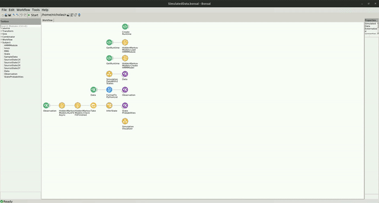

# Simulated Data Example

The code for this repo can be found [here](https://github.com/bonsai-rx/machinelearning-examples/tree/main/examples/HiddenMarkovModels/SimulatedData).

In the following example, you can see how the Hidden Markov Model (HMM) can be used to infer the underlying hidden state of a system producing observations from 2 distinct multivariate distributions.

### Dependencies

If you used the bootstrapping method, you dont have to worry about the package dependencies, as these should be already installed. However, if creating a new environment or integrating into an existing one, you will need to install the following packages:

* Bonsai - Core v2.8.1
* Bonsai - Design v2.8.0
* Bonsai - Editor v2.8.0
* Bonsai - Gui Zedgraph v0.1.1
* Bonsai - ML v0.2.0
* Bonsai - ML Hidden Markov Models v0.2.0
* Bonsai - ML Visualizers Hidden Markov Models v0.2.0
* Bonsai - Numerics v0.9.0
* Bonsai - Scripting Python v0.2.0

### Workflow

Below is the workflow.

:::workflow

:::

In this example, a Hidden Markov Model (HMM) is used to infer the hidden state of a simulated system. The workflow creates a python runtime (`CreateRuntime`), loads the HMM module (`LoadHMMModule`), and then initializes an HMM model with 2 states (`CreateHMMModel`). The simulation, encapsulated by a group workflow (`SimulatedDataWith2States`), generates data from 2 distinct multivariate normal distributions. The distribution that the simulation draws samples from switches at a specified rate. These `Data` are then formatted into a string representation of a python list, and subsequently fed as `Observation`s to the HMM model. The HMM model performs inference of the hidden state (`InferState`) given the observation.

When the HMM model is created, the parameters are not yet fit to the data. After 80 data points, the mini batch of data is sent to the model to be fit to the data (`RunFitAsync`). Once the fitting procedure completes asynchronously, the model's parameters will be better tuned to the system, and the model begins performing inferrence of the state of the simulated system. 

To visualize this, the `SimulationVisualizer` group node displays 2 graphs. On the left, the X and Y data samples are plotted as individual points in the scatter plot. After a few samples, you should start to see 2 distinct clusters emerge. On the right, you will see the inferred state of the model, represented as the probability of being in a particular state. After the model has been fit, you should see that the inferred state aligns with the cluster that data samples are being drawn from.

This is how it should look:

