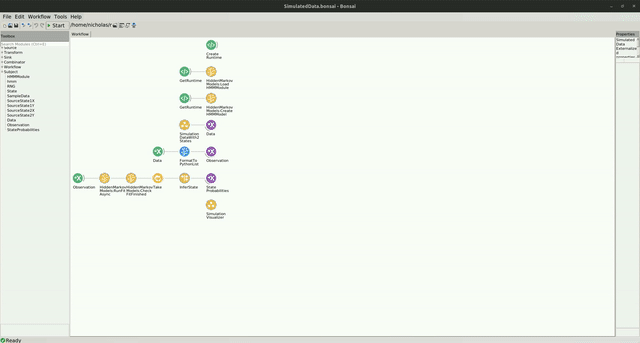

# Simulated Data Example

The code for this repo can be found [here](https://github.com/bonsai-rx/machinelearning-examples/tree/main/examples/HiddenMarkovModels/SimulatedData).

In the following example, you can see how the Hidden Markov Model (HMM) can be used to infer the underlying hidden state of a system producing observations from two distinct multivariate distributions.

### Instructions

Ensure you have Bonsai 2.9 installed on your system. You will also need to have the [uv Python environment manager](https://docs.astral.sh/uv/) installed.

> [!NOTE]
> The `ssm` package uses an old version of `setuptools` that is incompatible with modern package management tools. Because of this, you first need to create a new Python virtual environment using `uv venv`, install the required packages using `uv pip install -r requirements.txt`, and then synchronize the Python environment using `uv sync --no-build-isolation`.

### Workflow

Below is the workflow.

:::workflow

:::

In this example, a Hidden Markov Model (HMM) is used to infer the hidden state of a simulated system. The workflow creates a python runtime (`CreateRuntime`), loads the HMM module (`LoadHMMModule`), and then initializes an HMM model with two states (`CreateHMM`). The simulation, encapsulated by a group workflow (`SimulatedDataWith2States`), generates data from two distinct multivariate normal distributions. The distribution that the simulation draws samples from switches at a specified rate. These `Data` are then formatted into a string representation of a python list, and subsequently fed as `Observation`s to the HMM model. The HMM model performs inference of the hidden state (`InferState`) given the observation.

When the HMM model is created, the parameters are not yet fit to the data. After 80 data points, the mini batch of data is sent to the model to be fit to the data (`RunFitAsync`). Once the fitting procedure completes asynchronously, the model's parameters will be better tuned to the system, and the model begins performing inferrence of the state of the simulated system.

To visualize this, the `SimulationVisualizer` group node displays two graphs. On the left, the X and Y data samples are plotted as individual points in the scatter plot. After a few samples, you should start to see two distinct clusters emerge. On the right, you will see the inferred state of the model, represented as the probability of being in a particular state. After the model has been fit, you should see that the inferred state aligns with the cluster that data samples are being drawn from.

This is how it should look:

