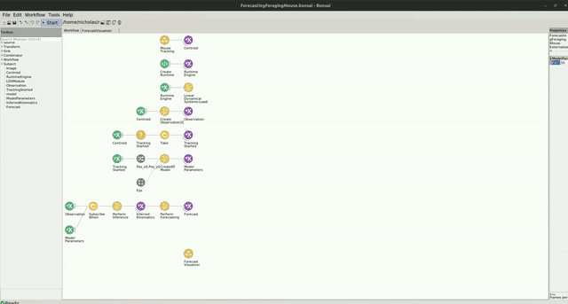

# Forecasting Foraging Mouse Example

The code for this repo can be found [here](https://github.com/bonsai-rx/machinelearning-examples/tree/main/examples/LinearDynamicalSystems/Kinematics/ForecastingForagingMouse).

In the following example, you can see how the Kalman Filter can be use to forecast the future kinematics of a mouse behaving in a foraging arena. This example is an extension to the [Foraging Mouse example](https://github.com/bonsai-rx/machinelearning-examples/tree/main/examples/LinearDynamicalSystems/Kinematics/ForagingMouse) with the addition of performing forecasting. 

### Dependencies

If you used the environment bootstrapping method, you dont have to worry about the package dependencies, as these should be already installed. However, if creating a new environment or integrating into an existing one, you will need to install the following packages:

* Bonsai - Core v2.8.1
* Bonsai - Design v2.8.0
* Bonsai - Editor v2.8.0
* Bonsai - ML v0.1.0
* Bonsai - ML LinearDynamicalSystems v0.1.0
* Bonsai - ML Visualizers v0.1.0
* Bonsai - Scripting v2.8.0
* Bonsai - Scripting Python v0.2.0
* Bonsai - Vision v2.8.1
* Bonsai - Vision Design v2.8.1

### Dataset

The video for this example was generously provided by the Sainsbury Wellcome Centre Foraging Behaviour Working Group. (2023). Aeon: An open-source platform to study the neural basis of ethological behaviours over naturalistic timescales, [https://doi.org/10.5281/zenodo.8413142](https://doi.org/10.5281/zenodo.8413142)

You can download the `ForagingMouseExampleVid.avi` video file here: [https://doi.org/10.5281/zenodo.10629221](https://doi.org/10.5281/zenodo.10629221). The workflow expects the video to be placed into the `datasets` folder but if you prefer to keep the video elsewhere, simply change the `Filename` property of the `MouseTracking` group node to point to the correct location.

### Workflow

The workflow is similar to the workflow used to infer the kinematics of a mouse during foraging (see example here)[https://github.com/bonsai-rx/machinelearning-examples/tree/main/examples/LinearDynamicalSystems/Kinematics/ForagingMouse] with the addition of a few nodes to forecast the future kinematics of the mouse.

:::workflow

:::

You can find specific information about the tracking workflow and model inference workflow by going to the Foraging Mouse example. In addition to the tracking workflow and model inference, only a few nodes are needed to perform optimization of the models parameters. Following the `PerformInference` node, which sends notifications to the `InferredKinematics` subject, the `PerformForecasting` node is used to make predictions about the kinematics of the mouse for a certain number of steps into the future, defined by the `Timesteps` property. The output of `PerformForecasting` is a type of `Forecast`, which contains a list of `ForecastResult` corresponding the predicted `KinematicState` at each timestep.

The `Forecast` can be visualized alongside the existing data by opening up the `ForecastVisualizer` group node, like so:

