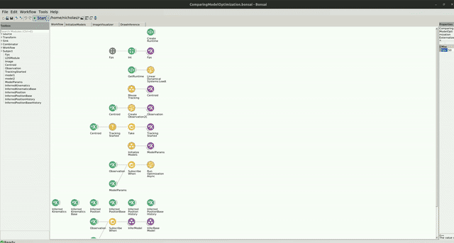

# Optimizing Model Parameters for Foraging Mouse Example

The code for this repo can be found [here](https://github.com/bonsai-rx/machinelearning-examples/tree/main/examples/LinearDynamicalSystems/Kinematics/ModelOptimizationForagingMouse).

In the following example, you can see how the parameters of the Kalman Filter can be automatically optimized to infer the kinematics of a mouse behaving in a foraging arena. This example is an extension to the [Foraging Mouse example](https://github.com/bonsai-rx/machinelearning-examples/tree/main/examples/LinearDynamicalSystems/Kinematics/ForagingMouse) in which the parameters of the model are optimized by learning the parameters of the model over small batches of training data. 

### Dependencies

If you used the environment bootstrapping method, you dont have to worry about the package dependencies, as these should be already installed. However, if creating a new environment or integrating into an existing one, you will need to install the following packages:

* Bonsai - Core v2.8.1
* Bonsai - Design v2.8.0
* Bonsai - Editor v2.8.0
* Bonsai - ML v0.2.0
* Bonsai - ML LinearDynamicalSystems v0.2.0
* Bonsai - ML Visualizers v0.2.0
* Bonsai - Scripting v2.8.0
* Bonsai - Scripting Python v0.2.0
* Bonsai - Vision v2.8.1
* Bonsai - Vision Design v2.8.1

### Dataset

The video for this example was generously provided by the Sainsbury Wellcome Centre Foraging Behaviour Working Group. (2023). Aeon: An open-source platform to study the neural basis of ethological behaviours over naturalistic timescales, [https://doi.org/10.5281/zenodo.8413142](https://doi.org/10.5281/zenodo.8413142)

You can download the `ForagingMouseExampleVid.avi` video file here: [https://doi.org/10.5281/zenodo.10629221](https://doi.org/10.5281/zenodo.10629221). The workflow expects the video to be placed into the `datasets` folder but if you prefer to keep the video elsewhere, simply change the `Filename` property of the `MouseTracking` group node to point to the correct location.

### Workflow

Below is the workflow. It is similar to the workflow that was used to infer the kinematics of a mouse during foraging (see example here)[https://github.com/bonsai-rx/machinelearning-examples/tree/main/examples/LinearDynamicalSystems/Kinematics/ForagingMouse] with the addition of a few nodes that will run optimization of the models parameters over small batches of data that are collected continuously.

:::workflow

:::

You can find specific information about the tracking workflow and model inference workflow by going to the Foraging Mouse example. In addition to the tracking workflow and model inference, only a few nodes are needed to perform optimization of the models parameters. There is a specific branch of the workflow where the `Observation` subject is subscribed to after the `ModelParams` fires, and gets passed to a `RunOptimization` node. This node has a number of properties which me be useful, such as the batch size of the training data, which parameters to optimize, etc. Once the data buffer is full, the model runs optimization asynchronously. You should see in the beginning that the model will tend to overshoot the position of the mouse, since the parameters are not well adjusted. Over time, the output of the model will improve and the inference of the model will more closely track the position of the mouse with multiple learning iterations. 

The easiest way to observe the effects that optimizing the models parameters has on the models output is to compare the outputs between a model that undergoes optimization and an identical model that retains its initial parameters. With each iteration, the optimized model will diverge from the unoptimized model and more closely track the position of the mouse. This is what you would see:

