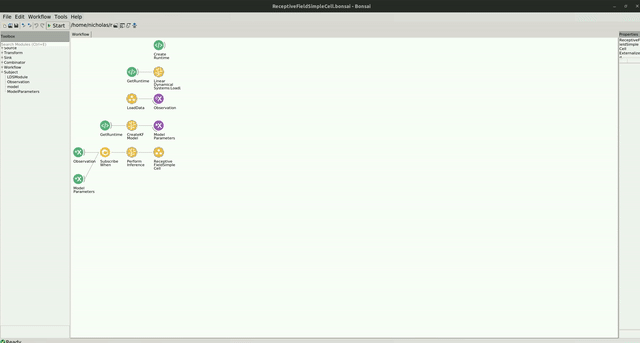

# Receptive Field Simple Cell

The code for this repo can be found [here](https://github.com/bonsai-rx/machinelearning-examples/tree/main/examples/LinearDynamicalSystems/BayesianLinearRegression/ReceptiveFieldSimpleCell).

In the following example, you can find how the Kalman Filter can be used to estimate the linear receptive field of a simple cell recorded from V1 of an anaesthetised cat.

### Dependencies

If you used the bootstrapping method, you dont have to worry about the package dependencies, as these should be already installed. However, if creating a new environment or integrating into an existing one, you will need to install the following packages:

* Bonsai - System v2.8.1
* Bonsai - ML LinearDynamicalSystems v0.1.0
* Bonsai - ML Visualizers v0.1.0

### Dataset

The data for this example was generously provided by the authors of "Touryan, J., Felsen, G., & Dan, Y. (2005). Spatial structure of complex cell receptive fields measured with natural images. Neuron, 45(5), 781-791."

You can download the `ReceptiveFieldSimpleCell.zip` dataset here: [https://doi.org/10.5281/zenodo.10629221](https://doi.org/10.5281/zenodo.10629221). It consists of 2 csv files: one which contains the all 144 pixel values of the 12 x 12 images for each timepoint, and one which contains the binned spike counts for a single neuron. Once downloaded, you will need to extract the contents of the zip file into the `datasets` folder.

### Workflow

Below is the example workflow for how to perform online estimation of the receptive field of a simple visual neuron. In the workflow, we use previously acquired data and read the values sequentially, but this workflow can easily be adapted to real-time stimulus presentation and online neural recording.

:::workflow

:::

In this example, a Kalman Filter is used to estimate the receptive field using Bayesian inference. It receives the pixel values, represented by a flattened array of the 2D visual stimulus, and infers the response of the neuron. In the `images.csv` file, there are 144 columns. These columns represent the pixel values of the stimulus that was displayed (a 12 x 12 image for a total of 144 pixels). The neuron's binned spike count is recorded in response to each image. These responses are recorded in the `responses.csv` file. In the `LoadData` group node, we read in the values from each csv file and zip them together. We add an additional feature to the image observations to represent our model's intercept. This is done when we convert the images csv data to a list in the `Format` node inside the `LoadData` group node. Since we are loading all of our data at once, we store the data inside of a `ReplaySubject` which will represent our `observation` of data.

In the `CreateKFModel` node, we specify the number of features that will be used observed at each time step. This number is set to the total number of pixels in our image (144 total) plus an additional feature that is used to represent the model intercept. We then specify the coefficients for our precision of the likelihood and the prior. 

We wait for the model to initialize and then subscribe to the data observations using the `SubscribeWhen` node. As the workflow runs, the model will perform bayesian inference to learn the visual features that the neuron responds strongly too. The neurons receptive field can then be visualized as the models state parameters evolving through time.

To visualize the neurons receptive field, double click on the `ReceptiveFieldSimpleCell` node at the bottom of the workflow while it is running. You should see a heatmap visualization of the receptive field. You can interact with this heatmap by left clicking to read the values at each pixel, right click to pan the image, or use the scroll wheel to zoom in/out. When you right click, you will see several options appear at the bottom of the visualizer's window where you can change the color palette and render method online. You can reset the plot to the original view by holding `Ctrl` and double right-click.

The window should look like this:

