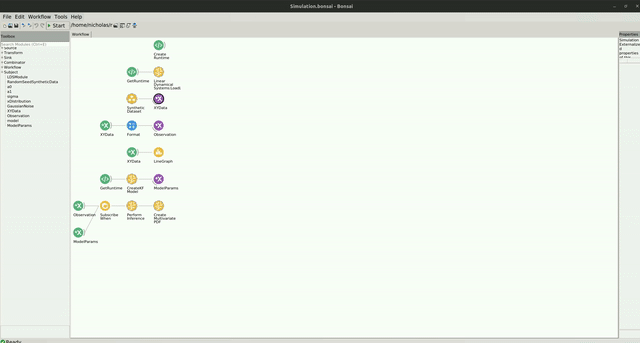

# Simulated Data

The code for this repo can be found [here](https://github.com/bonsai-rx/machinelearning-examples/tree/main/examples/LinearDynamicalSystems/BayesianLinearRegression/SimulatedData).

In the following example, you will see how the Kalman Filter can be used to perform Bayesian linear regression to estimate the parameters of a simple linear model with some added gaussian noise.

### Dependencies

If you used the bootstrapping method, you dont have to worry about the package dependencies, as these should be already installed. However, if creating a new environment or integrating into an existing one, you will need to install the following packages:

* Bonsai - System v2.8.1
* Bonsai - ML LinearDynamicalSystems v0.2.0
* Bonsai - ML Visualizers v0.2.0

### Workflow

Below is the example workflow for how to perform bayesian linear regression with noisy data generated from a simple linear model.

:::workflow

:::

We use a linear model to generate simulated data. The linear model takes the form:

$$
Y_t = \beta_0 + \beta_1 X_t + \epsilon_t
$$

In the `SimulatedData` group node, we define the parameters of the linear model that are used to generate our data. We evaluate our linear model by passing in values of x, which are randomly selected from a uniform distribution. We then generate a noisy observation by taking the output of the model and adding some noise to the data by randomly sampling from a normal distribution.

In the `CreateKFModel` node, we specify the number of features that will be included in our observations at each time step. Since our model has 2 parameters, we set the number of features to 2. We then specify the coefficients for our precision of the likelihood and the prior.

We wait for the model to initialize and then subscribe to the data observations using the `SubscribeWhen` node. As the workflow runs, the model will perform inference to learn the parameters of the underlying linear model used to generate the simuated data. We can then visualize the posterior of the model by creating a multivariate distribution over parameter space that covers a range of values around the true parameters of our linear model.

To visualize the multivariate distribution, double click on the `CreateMultivariatePDF` node at the bottom of the workflow while it is running. You should see a heatmap visualization of the multivariate distribution. You can interact with this heatmap by left clicking to read the values at each pixel, right click to pan the image, or use the scroll wheel to zoom in/out. When you right click, you will see several options appear at the bottom of the visualizer's window where you can change the color palette and render method online. You can reset the plot to the original view by holding `Ctrl` and double right-click.

The window should look like this:

