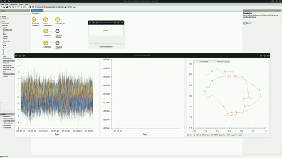

# Inferring Latents from a Simulated Dynamical System

In the following example, we simulate a dynamical system and infer the latent state from observations of noisy spike counts.

### Simulation

We start with a system that has the following dynamics:

$$
x(t+1) = \rho \cdot R(\omega) \cdot x(t) + w(t)
$$

where $\rho$ and $R(\omega)$ control the rotational dynamics and $w(t) \sim \mathcal{N}(0, \sigma_1^2 I_2)$ is the process noise. We then generate the following observations of the latent state:

$$
y(t) = Cx(t) + \epsilon(t)
$$

where $C \in \R^{d,2}$ is the observation matrix projecting the latent state into a $d$ dimensional "neural" space, with $\epsilon(t) \sim \mathcal{N}(0, \sigma_2^2I_d)$ added Gaussian noise.

### Running the Workflow

The example workflow is shown here:

:::workflow

:::

The first group node, `SimulatedDynamics`, implements the simulation logic which creates the rotational dynamics and generates observations from the latent state.

The `LearnParameters` group node uses the `ExpectationMaximization` algorithm to optimize the model's parameters over a single batch of observations. Once the EM algorithm is finished, the resulting parameters are used by `CreateKalmanFilter` to initialize a new model with the optimized parameters.

Once the EM algorithm is complete, the model is used in the `InferLatents` group node, which controls the data stream for inferring the system latents from new observations.

When the workflow runs, initially there is a period of collecting enough samples for the first batch to run the EM algorithm. Once the batch is full, the EM procedure begins to iteratively maximize the negative log likelihood until either the algorithm converges or it reaches the maximum number of iterations.

### Demo

The visualizer shows 3 graphs. The graph on the left represents the $d$ dimensional Gaussian observations that are being generated from the dynamical system. The middle graph shows the negative log likelihood of the EM algorithm after each iteration. The graph on the right shows the true system state, along with the inferred system state once the EM algorithm completes.

