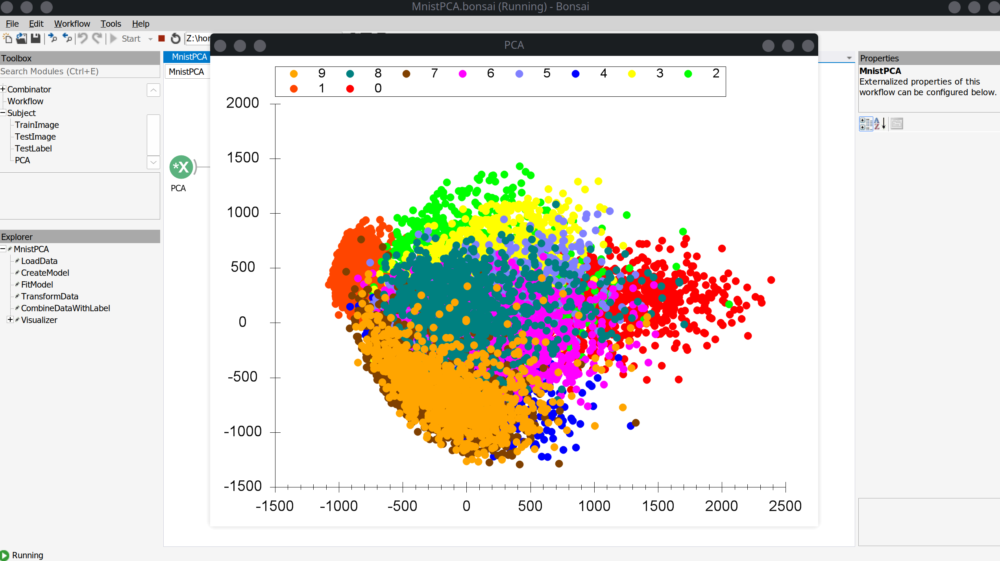

# Batch fitting a standard PCA model to the MNIST dataset

The following example shows how to use `Bonsai.ML.Pca.Torch` to fit a standard PCA model to the MNIST dataset.

## Dataset

The dataset used in this example can be obtained by going to [this url](http://yann.lecun.com/exdb/mnist/). This example uses both the training and testing datasets, so download all 4 of the urls. The workflow expects the datasets to be placed into the `datasets/MNIST/raw` folder. The path should be `datasets/MNIST/raw/*.gz`.

### Workflow

Below is the example workflow.

:::workflow

:::

The workflow can be broken down into the following sections.

1. `LoadData` - Uses a custom extension for loading the MNIST dataset from the `*.tar.gz` files contained in the `datasets/` folder. It loads the training images for fitting the PCA model, and then loads the testing images and labels for displaying the results of fitting.
2. `CreateModel` - This is where we create the PCA model. In this case, we use a standard `Pca` model type and set the number of components that we want to fit to 2.
3. `FitModel` - Once the model is created, we run the fitting procedure. In this example, we take the training images, flatten them into a single dimension, then concatenate them into a batch. Once the images have been batched, we pass this to the `Fit` operator which takes our `PCA` model and fits it to the data.
4. `TransformData` - After fitting the model, we essentially do the same thing for fitting but now we take the test images, flatten them into a single dimension and combine them into a batch to transform all at once. The output of transform contains each datapoint projected into the PCA component space.
5. `CombineDataWithLabel` - Here, we simply combine each of the transformed datapoints with their corresponding label to be used for plotting.
6. `Visualizer` - Displays the transformed data in the PCA component space, with the color of the data corresponding to the label provided for the original image.

### Screenshot

